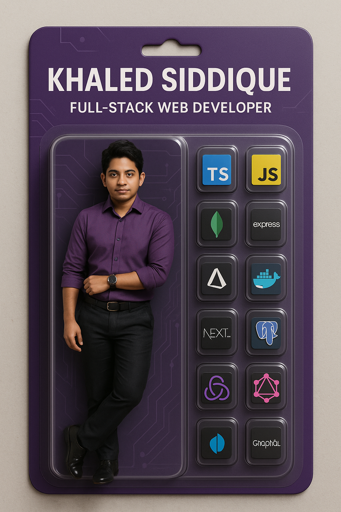

<h1 align="center">Hi 👋, I'm Khaled Siddique</h1>
<h3 align="center">
  
</h3>
<!-- 

    

 -->

<!--  -->

  

  

## 🛠 Skills & Tools

| **Category** | **Tech Stack**                                      |
| :----------- | :-------------------------------------------------- |
| **Frontend** | `React` `Next.js` `Redux` `TailwindCSS` `AntDesign` |
| **Backend**  | `Node.js` `Express` `NestJS` `Firebase`             |
| **Database** | `PostgreSQL` `Prisma` `MongoDB` `Mongoose` `MySQL`  |
| **DevOps**   | `Docker` `AWS` `Git` `GitHub`                       |
| **Design**   | `Figma`                                             |

 

## 🚀 About Me

- 🔭 I’m currently working on **Next.js & NestJS Microservices**
- 🌱 I’m currently learning **AWS & Docker Deployment**
- 💬 Ask me anything about **Next.js, NestJS, Docker, AWS, PostgreSQL, Prisma,
  JavaScript, TypeScript etc.**
- 📫 Reach me at: **khaledssbd@gmail.com**
- 😄 My website:
  [**khaled-siddique.vercel.app**](https://khaled-siddique.vercel.app)

 

## 📈 GitHub Analytics: A Deeper Dive

  

  

  

  

    
  

  

  

<!-- 

   

  

 -->

<!--    -->

<!-- 

 -->

  

<!-- 
  
 -->

 
<h2>Languages and Tools 
              </h2>
            
<!-- ## ⚒️ Languages and Tools -->

  &nbsp;&nbsp;
  &nbsp;&nbsp;
  &nbsp;&nbsp;
  &nbsp;&nbsp;
  &nbsp;&nbsp;
  <a href="https://nextjs.org/" target="_blank" rel="noreferrer">
    <picture>
      <source media="(prefers-color-scheme: dark)" srcset="https://cdn.simpleicons.org/nextdotjs/white">
      
    </picture>
  </a>&nbsp;&nbsp;
  <a href="https://tanstack.com/start" target="_blank" rel="noreferrer">
    <picture>
      <source media="(prefers-color-scheme: dark)" srcset="https://cdn.simpleicons.org/tanstack/white">
      
    </picture>
  </a>&nbsp;&nbsp;
  &nbsp;&nbsp;
  &nbsp;&nbsp;
  &nbsp;&nbsp;
  <a href="https://ui.shadcn.com" target="_blank" rel="noreferrer">
    <picture>
      <source media="(prefers-color-scheme: dark)" srcset="https://cdn.simpleicons.org/shadcnui/white">
      
    </picture>
  </a>

  <a href="https://nodejs.org" target="_blank" rel="noreferrer">
    <picture>
      <source media="(prefers-color-scheme: dark)" srcset="https://cdn.simpleicons.org/nodedotjs/white">
      
    </picture>
  </a>&nbsp;&nbsp;
  <a href="https://expressjs.com" target="_blank" rel="noreferrer">
    <picture>
      <source media="(prefers-color-scheme: dark)" srcset="https://cdn.simpleicons.org/express/white">
      
    </picture>
  </a>&nbsp;&nbsp;
  &nbsp;&nbsp;
  &nbsp;&nbsp;
  &nbsp;&nbsp;
  &nbsp;&nbsp;
  &nbsp;&nbsp;
  &nbsp;&nbsp;
  <a href="https://www.prisma.io" target="_blank" rel="noreferrer">
    <picture>
      <source media="(prefers-color-scheme: dark)" srcset="https://cdn.simpleicons.org/prisma/white">
      
    </picture>
  </a>

  &nbsp;&nbsp;
  &nbsp;&nbsp;
  &nbsp;&nbsp;
  <a href="https://github.com" target="_blank" rel="noreferrer">
    <picture>
      <source media="(prefers-color-scheme: dark)" srcset="https://cdn.simpleicons.org/github/white">
      
    </picture>
  </a>&nbsp;&nbsp;
  &nbsp;&nbsp;
  

 

## Featured Projects 🌟

- 🛒 **[SwiftCart](https://github.com/khaledssbd/SwiftCart)** - A modern
  E-commerce platform built with Next.js, Redux, and NestJS.
- 🌿 **[ThinkGreenly](https://github.com/khaledssbd/ThinkGreenly)** - A
sustainability-focused web application promoting eco-friendly habits.
<!-- - 📱 **[NativeHealth](https://github.com/khaledssbd)** - A React Native mobile
  app for health tracking (In Progress). -->

 
  
## 🤝 Connect With Me

  

    <a href="https://www.linkedin.com/in/mdkhaledsshuvo" target="_blank"> 💼 <b>LinkedIn</b> </a> &nbsp; | &nbsp;
    <a href="https://twitter.com/mdkhaledsshuvo" target="_blank"> 🐦 <b>Twitter</b> </a> &nbsp; | &nbsp;
    <a href="https://fb.com/mdkhaledsshuvo" target="_blank"> 👥 <b>Facebook</b> </a> &nbsp; | &nbsp;
    <a href="https://www.instagram.com/mdkhaledsshuvo" target="_blank"> 📸 <b>Instagram</b> </a> &nbsp; | &nbsp;
    <a href="https://medium.com/@mdkhaledsshuvo" target="_blank"> 📝 <b>Medium</b> </a> &nbsp; | &nbsp;
    <a href="mailto:khaledssbd@gmail.com"> 📧 <b>Gmail</b> </a>
  

 

  
<i>"The only way to do great work is to love what you do." - Steve Jobs</i>

  
Thanks for stopping by! Have a great day! 😊

  
 ❤️ From <a href="https://khaled-siddique.vercel.app"> <b>Khaled Siddique</b> </a> 

 

  

<!-- ⭐️ From [khaledssbd](https://khaled-siddique.vercel.app) -->
