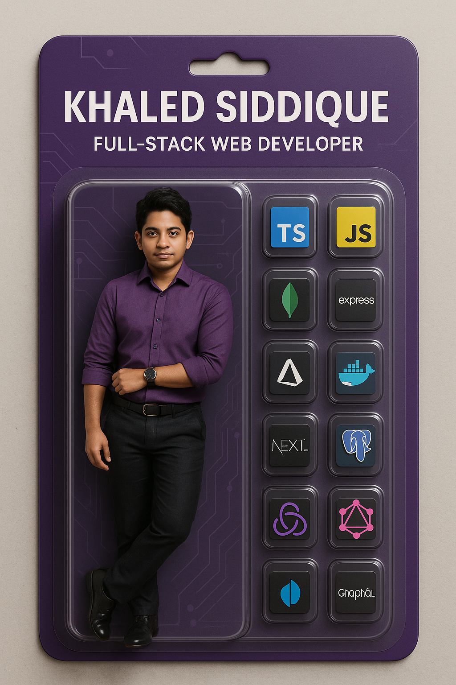

 <h1 align="center">Hi 👋, I'm Khaled Siddique</h1>
<h3 align="center">A passionate FULL Stack Web Developer from 🇧🇩</h3>
<!-- 

    

 -->

  

<h2> About Me  </h2>

### 🔭 I’m currently working on Nextjs with differnt Back-end

### 🌱 I’m currently learning React-Native.

### 💬 Ask me anything about Nextjs, React, Redux, PostgreSQL, Prisma, Mongoose, JavaScript, TypeScript etc.

### 📫 Reach me at: khaledssbd@gmail.com

### 😄 My website: [https://khaled-siddique.vercel.app](https://khaled-siddique.vercel.app)

 
 

# Statistics 📈

  

  

  

  

  

 

<h2>Languages and Tools </h2>

 &nbsp;&nbsp;
 &nbsp;&nbsp;
 &nbsp;&nbsp;
 &nbsp;&nbsp;
 &nbsp;&nbsp;
 &nbsp;&nbsp;
      

   &nbsp;&nbsp;
   &nbsp;&nbsp;
   &nbsp;&nbsp;
   &nbsp;&nbsp;
   &nbsp;&nbsp;
   &nbsp;&nbsp;
   
  

   &nbsp;&nbsp;
   &nbsp;&nbsp;
   &nbsp;&nbsp;
   &nbsp;&nbsp;
   &nbsp;&nbsp;
   &nbsp;&nbsp;
   

 

## 🌟 Featured Projects

 
  

 
  
<h2>Connect With Me </h2> 
 

  &nbsp;&nbsp;&nbsp;&nbsp;&nbsp;
  &nbsp;&nbsp;&nbsp;&nbsp;&nbsp;
  &nbsp;&nbsp;&nbsp;&nbsp;&nbsp;
  &nbsp;&nbsp;&nbsp;&nbsp;&nbsp;
  &nbsp;&nbsp;&nbsp;&nbsp;&nbsp;
  

   

⭐️ From [khaledssbd](https://khaled-siddique.vercel.app)
